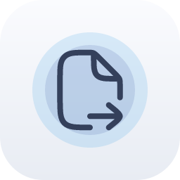
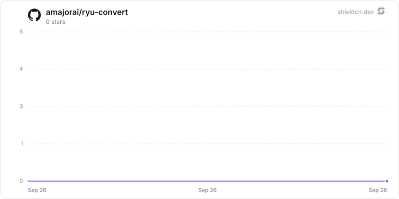

<p align="center">
  <picture>
    <source media="(prefers-color-scheme: dark)" srcset="./icon-dark.png" />
    
  </picture>
</p>

<div align="center">

# Convert

</div>

A local-only file conversion Companion for images, PDFs, documents, structured data, archives, and browser media.

> **The public home of `ryu-convert`.** Source, builds, and releases live here —
> binaries for every platform are attached to each release.
>
> This tree is generated from the Ryu monorepo, so commits pushed here
> directly are replaced on the next sync. **Pull requests are welcome** —
> open them here and they are ported into the monorepo, then flow back out.
> Ryu as a whole: https://github.com/amajorai/ryu

## Install

**App:** [Install](ryu://apps/@ryu/convert) (opens the Ryu desktop app and asks you to confirm)

**CLI:**

```bash
ryu apps add @ryu/convert
```

## Source & build

This is the **source of record** for the app UI. It imports Ryu's private
`@ryu/ui` design system, so it does **not** build standalone outside the
monorepo — it **builds inside the amajorai/ryu monorepo workspace**.
The **shipped bundle below is the built artifact**: a prebuilt single-file
companion bundle is included at [`dist/convert.ui.html`](./dist/convert.ui.html) —
the runnable UI Ryu loads for this app.

## License

Apache-2.0 — see [LICENSE](./LICENSE).

## Included workflow

- Drop or select multiple files in one batch.
- Convert browser-readable images to PNG, JPEG, WebP, AVIF, or PDF.
- Convert text, Markdown, HTML, JSON, CSV, and YAML locally, including JSON ↔ CSV/YAML.
- Create a PDF from text or an image without uploading the source.
- Merge multiple PDFs in the active batch into one local `combined.pdf`.
- Run PDF tools for split, page extraction, rotation, compression, watermarking, and page numbers.
- Extract selectable PDF text to TXT or Markdown locally; scanned PDFs require a local OCR engine.
- Run an image lab for resize, crop, rotate, watermark, quality, and output-format changes.
- Download completed batches as a ZIP archive.
- Inspect ZIP manifests locally as JSON, TXT, Markdown, or PDF without decoding archive bytes as text.
- Re-emit PDF files locally and convert browser-supported audio/video through the local
  Mediabunny/WebCodecs adapter to MP4, MOV, MKV, WebM, MPEG-TS, WAV, MP3, Ogg, FLAC,
  AAC, or M4A when the source codec is decodable.
- Download each result individually and keep a small local conversion history.

The app has no sidecar, makes no network requests, and does not require Docker. Formats that
need an office, OCR, ebook, camera-RAW, or legacy media engine remain visibly input-only rather
than pretending to convert successfully.
Inside Ryu, history uses the app-scoped storage bridge. A standalone browser preview
uses browser-local storage instead; it never treats a missing live host bridge as a
successful remote save.

## Build and test

```sh
bun run --cwd apps-store/convert/ui test
bun run --cwd apps-store/convert/ui check-types
bun run --cwd apps-store/convert/ui build
```

The UI build emits one self-contained `dist/index.html` for the sandboxed Companion host.

## Star History

<a href="https://github.com/amajorai/ryu-convert/stargazers">
  <picture>
    <source media="(prefers-color-scheme: dark)" srcset="./.github/shieldcn/star-chart-dark.svg" />
    
  </picture>
</a>
